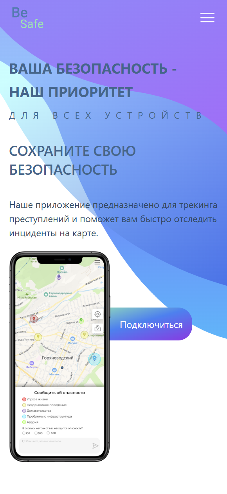
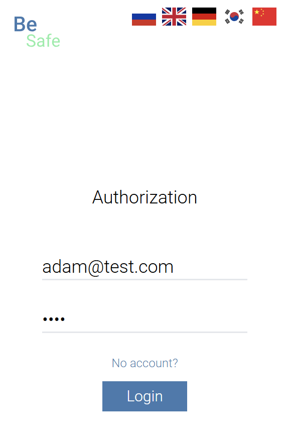
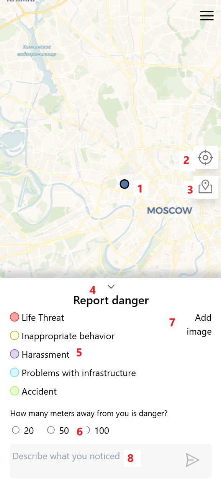

<a id="anchor"></a>

# BeSafe app 
Web application for tracking crimes (the ability to track emergencies and add a mark on the map). You are required to register and provide the geolocation of your gadget.

In current app you have such opportunities as:
* Using map over the world,
* Set Marks by your location,
* Add Photo to your Mark, 
* Edit and delete your Mark, 
* Edit (setting Avatar too) and delete your Profile,
* Watch other crimes next to your location and in other cities too

There is also separated types of crimes introducing page. + the application supports _Russian, English, German, Korea and Chinese._

***

The project is written due to __NodeJS__ + __ReactJS__ + __mongoose__ + __express__ + __Redux Toolkit__ + __leaflet__ + __TailwindCSS__

Other libraries: __axios__ + __framer-motion__ + __i18next__ + __moment__ + __nodemailer__ + __react-hook-form__ + __toastify__ + __swiper__

***

### Page structure:

1. Main (modal windows, setting / watching / deleting marks, )
2. Login / Registration
3. Profile
4. AdminPanel (only for author)
5. Not Found
6. LandingPage

***

### Instruction:
* LandingPage



1. Brief info about App and Development
2. "Sign In" button - it leads you to the main page 

* Login / Registration



1. User can Log In or Registrate his/her account
2. User must follow input rules for valid characters



1. User's location
2. Button which moves user to his location smoothly
3. Button for watching other crimes around user
4. Modal Window for making report
5. Types of crimes
6. Distance from user to crime
7. Add image to Mark / Report
8. Field for descripton (and button for sending request)

Feature 
: User's location is gotten by __leaflet__ library and inner browser location feature

getLocation.js
```
import { getMe } from "../redux/features/authSlice";

export const getLocation = (setUserLocation, dispatch, setLoadingUser) => {
    if (navigator.geolocation) {
        navigator.geolocation.getCurrentPosition(
            (position) => {
                const { latitude, longitude } = position.coords;
                setUserLocation([latitude, longitude])
            },
            (error) => {
                console.error('Error getting user location:', error);
            }
        )
    } else {
        console.error('Geolocation is not supported by this browser.');
    }

    dispatch(getMe())
    setLoadingUser(false);
}
```

Home.jsx
```
const Home = React.memo(() => {
    const [userLocation, setUserLocation] = useState(null);

    useEffect(() => {
        getLocation(setUserLocation, dispatch, setLoadingUser);
    }, [dispatch]);

    return (
        <div className="min-h-screen">
            <div className='w-full h-full relative'>
                <Bars3Icon onClick={() => setShowMenu(prev => !prev)} className='absolute z-40 w-8 h-w-8 right-3 top-3 cursor-pointer' />
                <Map userLocation={userLocation} selectedMarkerPosition={selectedMarkerPosition} setOpenModal={setOpenModal} />
            </div>
    )
});
```

Map.jsx
```

const Map = React.memo(({ userLocation, selectedMarkerPosition, setOpenModal }) => {
    const mapRef = useRef();

    const fetchMarkers = useCallback(async () => {
        try {
            dispatch(getAllMarkers());
        } catch (error) {
            console.log(error);
        }
    }, [dispatch]);

    useEffect(() => {
        fetchMarkers();
    }, [dispatch, fetchMarkers]);

    useEffect(() => {
        if (mapRef.current && selectedMarkerPosition) {
            mapRef.current.setView(selectedMarkerPosition, mapRef.current.getZoom());
        }
    }, [selectedMarkerPosition]);

    const backToMe = () => {
        if (mapRef.current && userLocation) {
            mapRef.current.setView(userLocation, mapRef.current.getZoom())
        }
    }

    if (userLocation === null) {
        return (
            <LoaderComponent />
        )
    }

    return (
        <div className='min-h-screen'>
            <MapContainer ref={mapRef} center={userLocation || selectedMarkerPosition} zoom={13} className='z-10 min-h-screen w-full relative'>
                <TileLayer
                    url="https://{s}.basemaps.cartocdn.com/rastertiles/voyager/{z}/{x}/{y}.png"
                    attribution="&copy; <a href='https://www.openstreetmap.org/copyright'>OpenStreetMap</a> contributors"
                />

                <Marker position={userLocation} icon={new L.icon({
                    iconUrl: userMarker,
                    iconSize: [40, 40],
                    iconAnchor: [16, 32],
                })}>
                    <Popup>{t('YourLocation')}</Popup>
                </Marker>

                <LayersControl position='bottomleft'>
                    {currentMarkers?.map((mapEl) => (
                        <NewMarker
                            key={mapEl._id}
                            _id={mapEl._id}
                            category={mapEl.category}
                            description={mapEl.description}
                            position={mapEl.position}
                            metres={mapEl.metres || 20}
                            author={mapEl.author}
                            createdAt={mapEl.createdAt}
                            image={mapEl?.image}
                        />
                    ))}
                </LayersControl>
            </MapContainer>
        </div>
    )
});

export default Map
```

[Up](#anchor)